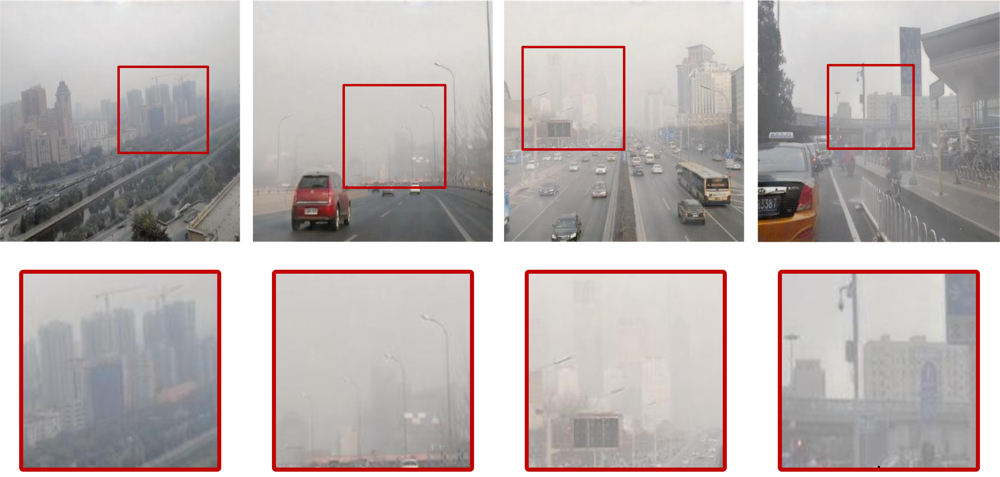

##### Table of Content

1. [Introduction](#introduction)
1. [Datasets](#datasets)
1. [Trained model](#trained-model)
1. [Getting Started](#getting-started)
	- [Requirements](#requirements)
	- [Usage Example](#usage)
1. [Generated images](#examples-of-dehazed-images-and-pseudo-real-hazy-images)
## Introduction
This is the PyTorch implementation *of* our paper *entitiled* "Single Image Dehazing via Semi-Supervised Domain Translation and Architecture Search "
## Datasets
### Training sets：
We adopted the same training set as [DA_dehazing](https://github.com/HUSTSYJ/DA_dahazing). All the images come from RESIDE dataset. Including 3000 synthetic hazy images in the Outdoor Training Set (OTS), 3000 synthetic hazy images in the Indoor Training Set (ITS), and 1000 real-world hazy images in the Unannotated Real Hazy Images set (URHI)
 - [DA_DATASETS](https://drive.google.com/drive/folders/10cP6Z-n2G0006_ppW1WxkQpNKg3mSfnj?usp=sharing).
### Testing sets：
We use four testing sets to evaluate our method:
 - Benchmarking Single Image Dehazing and Beyond  [SOTS-OD](https://drive.google.com/drive/folders/10cP6Z-n2G0006_ppW1WxkQpNKg3mSfnj?usp=sharing)
 - O-HAZE:A Dehazing Benchmark with Real Hazy and Haze-free Outdoor Images  [O-HAZE](http://www.vision.ee.ethz.ch/ntire18/o-haze/O-HAZE.zip)
 - Densehaze:A Benchmark for Image Dehazing with Dense-haze and Haze-free Images  [DENSE-HAZE](https://data.vision.ee.ethz.ch/cvl/ntire19/dense-haze/files/Dense_Haze_NTIRE19.zip)
 - NH-HAZE: An Image Dehazing Benchmark with Non-homogeneous Hazy and Haze-free Images  [NH-HAZE](https://data.vision.ee.ethz.ch/cvl/ntire20/nh-haze/files/NH-HAZE.zip)
## Trained model
 - The trained model of fusion dehazing network is at Google drive: [Checkpoint](https://drive.google.com/file/d/1vHydxmBH8o5HuxVyG4ojRZWrr788zOp5/view?usp=sharing)

## Getting Started
### Requirements
1. Python 3.7
2. PyTorch 1.8.0
3. CUDA 9.1
4. Ubuntu 20.04

### Usage
Clone the repo
```
git clone https://github.com/jklp2/SID_Semi-Supervised_Domain_Translation.git
cd SID_Semi-Supervised_Domain_Translation
```
Download the trained [checkpoints](pretrained-checkpoint)
Put your hazy images in the `input` folder, and run:
```
python test.py --model cra_unrolled_final --resume --ckpt_path $CKPT_PATH
```
where $CKPT_PATH denotes the path of the checkpoints. The results will be saved in the `output` folder.
## Examples of dehazed images and pseudo-real hazy images
#### SOTS-OD
[Download link](https://drive.google.com/file/d/10EbzBsxML4DqvxapvhuXXOmLcA11pNRD/view?usp=sharing)

#### O-HAZE
[Download link](https://drive.google.com/file/d/1n2VRc5iiYbPefthuM471X_psuhig4MD2/view?usp=sharing)

#### DENSE-HAZE
[Download link](https://drive.google.com/file/d/1ISdv7ugn_b74zDqvO5mjTZSqytjwz3IV/view?usp=sharing)

#### NH-HAZE
[Download link](https://drive.google.com/file/d/1xH-99_KfctaDDhV9ajZxiNl611BJMy6i/view?usp=sharing)

#### Serveral S2R Results: Examples of pseudo-real hazy images generated in the S2R task. 

